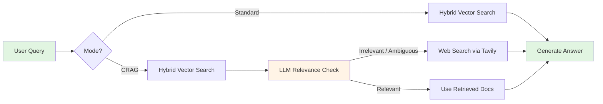

<div align="center">

# CRAG Hybrid RAG

### *Corrective RAG with Hybrid Vector Search*

[](https://www.python.org/downloads/)
[](https://fastapi.tiangolo.com)
[](https://qdrant.tech)
[](https://openai.com)
[](https://docs.astral.sh/uv/)
[](https://opensource.org/licenses/MIT)

<p align="center">
  <i>Hybrid Vector Search • Relevance Evaluation • Web Search Fallback • Optional Reranking</i>
</p>

[Features](#-features) • [Quick Start](#-quick-start) • [Architecture](#-architecture) • [API](#-api-endpoints)

<br>

```
╔══════════════════════════════════════════════════════════════╗
║                                                              ║
║   📚 Upload Documents  →  🔍 Hybrid Search  →  🤖 LLM Gen    ║
║                                                              ║
║   ✅ Hybrid Search: Dense + Sparse + RRF Fusion             ║
║   ✅ CRAG: Adaptive Web Search Based on Relevance           ║
║   ✅ Standard: Fast direct RAG from your documents          ║
║                                                              ║
╚══════════════════════════════════════════════════════════════╝
```

</div>

---

## Features

<table>
<tr>
<td width="50%">

### CRAG Mode
- LLM-based relevance evaluation
- Adaptive web search (Tavily) when docs are insufficient
- Smart routing: relevant / ambiguous / irrelevant
- Real-time data access

</td>
<td width="50%">

### Standard Mode
- Direct hybrid vector retrieval
- Fast single-pass generation
- Dense + sparse + RRF fusion
- Ideal for well-stocked knowledge bases

</td>
</tr>
<tr>
<td width="50%">

### Hybrid Search
- Dense semantic search (OpenAI embeddings)
- Sparse BM25 keyword search
- Reciprocal Rank Fusion (RRF) combining both
- Dual vector storage in Qdrant

</td>
<td width="50%">

### Optional Reranking
- Cross-encoder reranking (local model)
- Voyage AI reranking (API)
- Configurable initial retrieval pool
- Improves precision for top-k results

</td>
</tr>
</table>

---

## Hybrid Search Modes

This system implements **true hybrid search** using Qdrant's dual vector system:

| Mode | Description | Best For |
|------|-------------|----------|
| **Dense** | Semantic search using OpenAI embeddings | Conceptual queries, synonyms |
| **Sparse** | BM25 keyword search with IDF weighting | Exact terms, technical jargon |
| **Hybrid** | RRF fusion of dense + sparse (default) | Best overall accuracy |

**Key Features:**
- **Dual Vector Indexing**: Every document gets both dense (1536-dim) and sparse (BM25) vectors
- **RRF Fusion**: Reciprocal Rank Fusion combines rankings from both search methods
- **Automatic Tokenization**: 50+ stop words filtered, term frequency analysis
- **Compatible**: Works with both Standard and CRAG modes, plus optional reranking

---

## Quick Start

### Prerequisites

```bash
Python 3.12+
Docker (for Qdrant)
OpenAI API Key
Tavily API Key (for CRAG mode)
```

### Installation

```bash
# 1. Install uv (ultra-fast package manager)
curl -LsSf https://astral.sh/uv/install.sh | sh

# 2. Clone and setup
git clone <repo-url>
cd crag-hybrid-rag
cp .env.example .env
# Edit .env with your API keys

# 3. Start services
docker run -p 6333:6333 qdrant/qdrant  # Terminal 1
uv run uvicorn app.main:app --reload   # Terminal 2
```

API running at http://localhost:8000 — Docs at http://localhost:8000/docs

---

## Architecture



### RAG Mode Comparison

| Feature | Standard | CRAG |
|---------|----------|------|
| **Hybrid Search** | ✅ | ✅ |
| **Web Search Fallback** | ❌ | ✅ |
| **Relevance Evaluation** | ❌ | ✅ |
| **Optional Reranking** | ✅ | ✅ |
| **Latency** | Fast | Medium |
| **Best For** | Internal docs Q&A | Mixed / current data |

---

## API Endpoints

### 1. Upload Document

```bash
curl -X POST "http://localhost:8000/upload/" \
  -F "file=@document.pdf"
```

Supported formats: PDF, Markdown, TXT, JSON

### 2. Query — Standard Mode

```bash
curl -X POST "http://localhost:8000/query/" \
  -H "Content-Type: application/json" \
  -d '{
    "query": "Summarise the key findings",
    "mode": "standard",
    "search_mode": "hybrid",
    "top_k": 5
  }'
```

### 3. Query — CRAG Mode

```bash
curl -X POST "http://localhost:8000/query/" \
  -H "Content-Type: application/json" \
  -d '{
    "query": "What are the latest AI developments?",
    "mode": "crag",
    "search_mode": "hybrid",
    "top_k": 5
  }'
```

Returns answer + relevance evaluation + web search results (if triggered).

### 4. Query with Reranking

```bash
curl -X POST "http://localhost:8000/query/" \
  -H "Content-Type: application/json" \
  -d '{
    "query": "Explain the methodology in detail",
    "mode": "crag",
    "search_mode": "hybrid",
    "top_k": 5,
    "enable_reranking": true
  }'
```

**Search mode options:** `"dense"` | `"sparse"` | `"hybrid"` (default)

### 5. Compare Both Modes

```bash
curl "http://localhost:8000/query/compare?query=Your%20question&top_k=5"
```

Returns side-by-side comparison of Standard and CRAG.

---

## Configuration

Key settings in `.env`:

```bash
# LLM
OPENAI_API_KEY=sk-...
LLM_MODEL=gpt-4o-mini

# Hybrid Search
HYBRID_SEARCH_ENABLED=true
SPARSE_VECTOR_ENABLED=true
RRF_K=60

# CRAG
CRAG_RELEVANCE_THRESHOLD=0.7
CRAG_AMBIGUOUS_THRESHOLD=0.5
TAVILY_API_KEY=tvly-...

# Vector Database
QDRANT_URL=http://localhost:6333
QDRANT_COLLECTION_NAME=crag_documents

# Reranking (optional)
RERANKING_ENABLED_BY_DEFAULT=false
RERANKER_BACKEND=local            # or 'voyage'
VOYAGE_API_KEY=                   # if using voyage backend
```

---

## Testing

```bash
# Run all tests
uv run pytest -v

# With coverage
uv run pytest --cov=app --cov-report=html
```

---

## Project Structure

```
crag-hybrid-rag/
├── app/
│   ├── api/              # FastAPI endpoints (query, upload)
│   ├── core/             # RetrievalService
│   ├── services/         # crag, llm_service, embedding, vector_store,
│   │                     # reranking, web_search, document_processor,
│   │                     # sparse_vector_service
│   ├── config.py         # Pydantic settings
│   └── models.py         # Request / response schemas
├── uploads/              # Uploaded documents
├── tests/                # Test suite
├── .env.example          # Config template
└── pyproject.toml        # Dependencies
```

---

## Technology Stack

| Component | Library |
|-----------|---------|
| API Framework | [FastAPI](https://fastapi.tiangolo.com) |
| Vector Database | [Qdrant](https://qdrant.tech) |
| LLM | [OpenAI GPT-4o-mini](https://openai.com) |
| Document Processing | [Docling](https://github.com/DS4SD/docling) |
| Web Search | [Tavily](https://tavily.com) |
| Package Manager | [uv](https://docs.astral.sh/uv/) |

---

## Research

- **CRAG**: [Corrective Retrieval Augmented Generation (2024)](https://arxiv.org/abs/2401.15884)

---

## License

MIT License — see [LICENSE](LICENSE) for details.

---

<div align="center">

**Built to demonstrate production-ready Corrective RAG with hybrid vector search**

[Report Bug](https://github.com/sourangshupal/crag-hybrid-rag/issues) • [Request Feature](https://github.com/sourangshupal/crag-hybrid-rag/issues)

</div>
