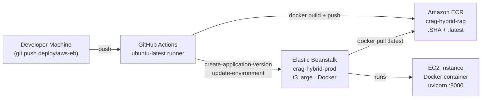
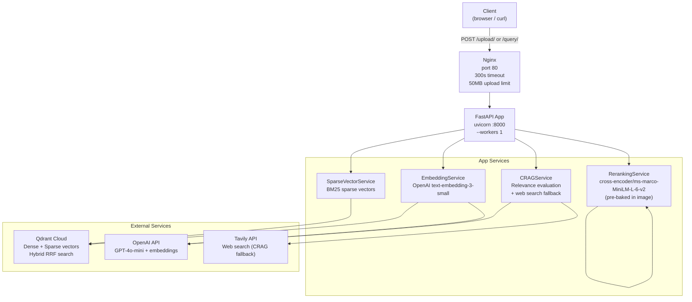
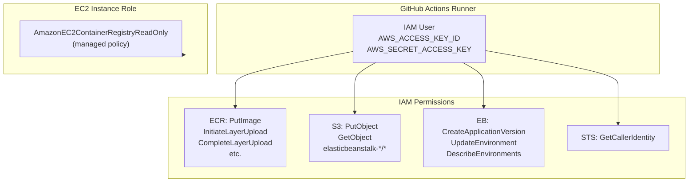
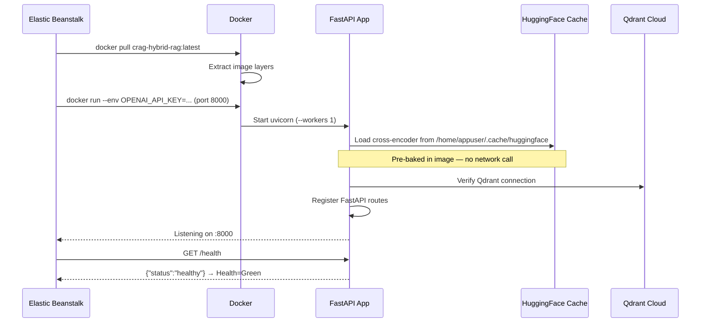

# AWS Elastic Beanstalk Deployment Architecture

## Deployment Pipeline

---

## Runtime Request Flow

---

## IAM Permissions Model

---

## Re-deploy Workflow (Iterative Development)

```mermaid
flowchart LR
    CODE["Edit code\nlocally"]
    PUSH["git push\ndeploy/aws-eb"]
    BUILD["GitHub Actions\ndocker build\n--platform linux/amd64"]
    PUSH_ECR["docker push\n:SHA + :latest"]
    ZIP["zip deploy.zip\nDockerrun + .platform\n+ .ebextensions"]
    S3["s3 cp deploy.zip\nelasticbeanstalk bucket"]
    EB_VER["create-application-version"]
    EB_UPD["update-environment\n+ inject env vars"]
    POLL["Poll 30s × 40\n(20 min max)"]
    READY["Status=Ready\nHealth=Green\nDeploy complete!"]

    CODE --> PUSH --> BUILD --> PUSH_ECR --> ZIP --> S3 --> EB_VER --> EB_UPD --> POLL --> READY
```

---

## Container Startup Sequence

---

*Author: Sourangshu Pal*
